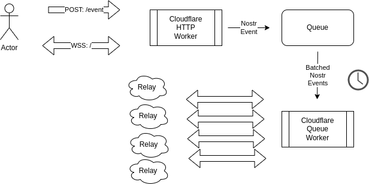

# blastr

A nostr cloudflare workers proxy relay that publishes to all known online relays.



This takes advantage of the high availabilty of cloudflare serverless workers on the edge that are rust wasm-based with 0ms cold starts. Learn more about [cloudflare workers](https://workers.cloudflare.com/).

This is write only for now and is compatible with nostr clients but also features a simple POST api endpoint at `/event`. All events get queued up to run in batches by another worker that spins up every 30s if there's any events lined up, or once a certain amount of events are queued up.

This will help ensure that your events are broadcasted to as many places as possible.

## Development

With `wrangler`, you can build, test, and deploy your Worker with the following commands:

```sh
# install wrangler if you do not have it yet
$ npm install -g wrangler

# compiles your project to WebAssembly and will warn of any issues
$ npm run build

# run your Worker in an ideal development workflow (with a local server, file watcher & more)
$ npm run dev

# deploy your Worker globally to the Cloudflare network (update your wrangler.toml file for configuration)
$ npm run deploy
```

Read the latest `worker` crate documentation here: https://docs.rs/worker

### CICD

There's an example workflow here for publishing on master branch pushes. You need to set `CF_API_TOKEN` in your github repo secrets first.

You also should either remove or configure `wrangler.toml` to point to a custom domain of yours:

```
routes = [
    { pattern = "example.com/about", zone_id = "<YOUR_ZONE_ID>" } # replace with your info
]
```

### WebAssembly

`workers-rs` (the Rust SDK for Cloudflare Workers used in this template) is meant to be executed as compiled WebAssembly, and as such so **must** all the code you write and depend upon. All crates and modules used in Rust-based Workers projects have to compile to the `wasm32-unknown-unknown` triple.

Read more about this on the [`workers-rs`](https://github.com/cloudflare/workers-rs) project README.
